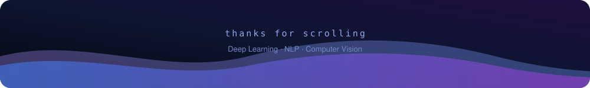

<!--
  Semua aset visual di README ini di-host di repo sendiri (folder /assets)
  dan di-generate lewat GitHub Actions (/.github/workflows).
  Tidak ada dependensi ke instance Vercel publik yang sering kena rate limit.
-->

  

Working across Deep Learning, NLP, and Computer Vision — building AI systems that go from experimentation to something usable, with a research-oriented approach to modeling and evaluation.

`Computer Science Student` · `Research-oriented AI/ML Practitioner`

 

 

 

**[About](#-about-me)** · **[What I Build](#-what-i-build)** · **[Projects](#-featured-projects)** · **[Tech Stack](#-tech-stack)** · **[Activity](#-github-activity)** · **[Connect](#-lets-connect)**

## 🧭 About Me

I'm a Computer Science student at Universitas Nusa Cendana, working at the intersection of Deep Learning, AI research, and ML engineering. Most of my applied work is in Indonesian-language NLP — sentiment analysis, sarcasm intensity classification, and sentence embeddings for semantic similarity — alongside Computer Vision work in image classification and industrial anomaly detection.

I completed the Bangkit Academy 2024 Machine Learning Learning Path, and led ArtScape, an AI-based art marketplace, as Team Leader.

I'm interested in the full loop of building AI systems: not just getting a model to perform well, but understanding how it behaves under evaluation and what it takes to make it usable beyond a notebook.

## 🛠 What I Build

<table>
<tr>
<td width="25%" valign="top" align="center">
<h3>🧠</h3>
<b>NLP & Language AI</b>
  
Indonesian NLP, sentiment analysis, sarcasm intensity classification, sentence embeddings, semantic textual similarity.
</td>
<td width="25%" valign="top" align="center">
<h3>👁</h3>
<b>Computer Vision</b>
  
Image classification, visual representation learning, and industrial anomaly detection.
</td>
<td width="25%" valign="top" align="center">
<h3>⚙️</h3>
<b>ML Engineering</b>
  
Model development, evaluation, experimentation, and deployment-oriented workflows.
</td>
<td width="25%" valign="top" align="center">
<h3>🔬</h3>
<b>Applied AI Research</b>
  
Measurable experimentation and reproducible evaluation of practical AI problems.
</td>
</tr>
</table>

## 🎯 Current Focus

 

## 🔁 Engineering Workflow

~~~mermaid
flowchart LR
    A[Problem] --> B[Data]
    B --> C[Exploration]
    C --> D[Representation / Features]
    D --> E[Modeling]
    E --> F[Evaluation]
    F --> G[Deployment]
~~~

> Not every project follows every stage — this represents my general approach to building and evaluating AI systems.

## 🚀 Featured Projects

<table>
<tr>
<td width="50%" valign="top">

### 🎨 ArtScape

AI-based art marketplace platform.

<code>Applied AI</code> <code>Product Development</code>

Role: Team Leader

</td>
<td width="50%" valign="top">

### 🧬 Indonesian Sentence Embeddings

Sentence embedding model for Indonesian semantic textual similarity, trained with a SimCSE-based approach using hard negative mining. Includes an interactive Gradio demo.

<code>NLP</code> <code>Sentence Embeddings</code> <code>SimCSE</code>

</td>
</tr>

<tr>
<td width="50%" valign="top">

### 🗣 Sarcasm Intensity Classification

Comparative study of transformer-based architectures for multi-level sarcasm intensity classification in Indonesian social media text, using IndoBERT.

<code>NLP</code> <code>Indonesian NLP</code> <code>IndoBERT</code>

**Macro F1**
<code>0.4535</code>&nbsp; on 16,790 examples

</td>
<td width="50%" valign="top">

### 🧪 Hybrid Word-Character Sentiment Analysis

Robustness evaluation of Indonesian sentiment models against synthetic noise, combining word-level (BiLSTM) and character-level (CNN) representations on the Twitter PPKM dataset (23,644 examples).

<code>NLP</code> <code>Sentiment Analysis</code> <code>Hybrid Representation</code>

Dataset & results: <a href="https://doi.org/10.5281/zenodo.19397894">Zenodo</a>

</td>
</tr>

<tr>
<td width="50%" valign="top">

### 🌿 Plant Disease Classification

Plant disease classification on the PlantVillage dataset (13.8K images, 10 classes), comparing MobileNetV2 and EfficientNetB0 with CLAHE-based preprocessing.

<code>Computer Vision</code> <code>Image Classification</code>

**Accuracy**
<code>94.09%</code> MobileNetV2 &nbsp;·&nbsp; <code>92.89%</code> EfficientNetB0

</td>
<td width="50%" valign="top">

### 🔍 MVTec Anomaly Detection

Industrial anomaly detection on the MVTec dataset, comparing PatchCore and a convolutional autoencoder.

<code>Computer Vision</code> <code>Anomaly Detection</code>

**AUROC**
<code>0.977</code> PatchCore &nbsp;·&nbsp; <code>0.581</code> Conv-Autoencoder

</td>
</tr>
</table>

## 💻 Tech Stack

<b>&nbsp;Languages</b>

 

<b>&nbsp;AI / Machine Learning</b>

 

<b>&nbsp;NLP</b>

 

<b>&nbsp;Computer Vision</b>

 

<b>&nbsp;Data Science</b>

 

<b>&nbsp;MLOps / Deployment</b>

 

## 📊 GitHub Activity

  

  

<picture>
  <source media="(prefers-color-scheme: dark)" srcset="https://raw.githubusercontent.com/f4tahitsYours/f4tahitsYours/output/snake-dark.svg"/>
  <source media="(prefers-color-scheme: light)" srcset="https://raw.githubusercontent.com/f4tahitsYours/f4tahitsYours/output/snake.svg"/>
  
</picture>

## 🔬 Research Interests

`Deep Learning` · `Natural Language Processing` · `Indonesian NLP` · `Representation Learning`

`Sentence Embeddings` · `Computer Vision` · `Anomaly Detection` · `Applied Machine Learning` · `ML Systems`

## 🏅 Highlights

|  |  |
|:---:|:---|
| 🎓 | Computer Science Student at Universitas Nusa Cendana |
| 🚀 | Completed Bangkit Academy 2024 — Machine Learning Learning Path (900+ hours, Google, GoTo, Traveloka) |
| 👑 | Team Leader, ArtScape |
| ☁️ | Google Cloud Arcade Facilitator 2025 — guided participants through hands-on Google Cloud labs |
| 📜 | Multiple ML, Data Science, and Cloud specializations (Coursera / Google / DeepLearning.AI) |
| 🧩 | Hands-on work across NLP, Computer Vision, and Deep Learning |

## 🤝 Let's Connect

Interested in AI/ML research, applied deep learning, NLP, computer vision, or practical ML systems? Feel free to connect.

 

  

